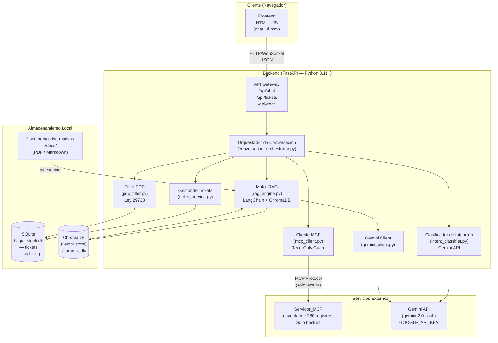
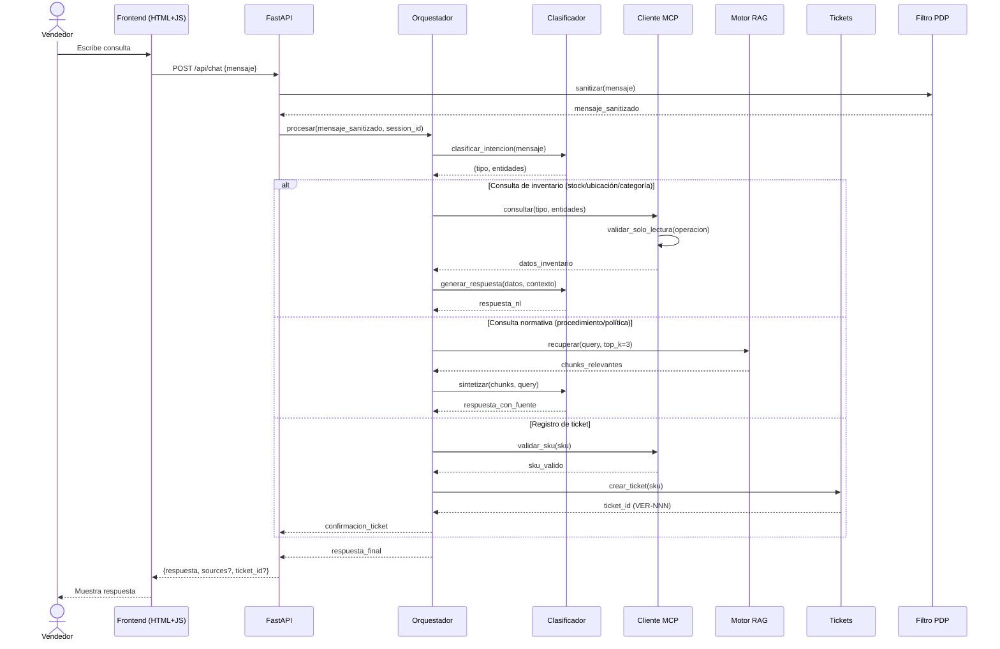

# Documento de Diseño Técnico — HegiaStock

## Resumen Ejecutivo

HegiaStock es un asistente conversacional de consulta y verificación de inventario para Inversiones Hegiapesa S.A.C. Este documento describe la arquitectura técnica, los modelos de datos, las interfaces de componentes y las propiedades de corrección que guían la implementación. El sistema integra tres fuentes de información: el Servidor_MCP de inventario (solo lectura), el Motor_RAG para normativas internas y una base de datos SQLite propia para tickets de verificación. Todo el procesamiento de lenguaje natural se delega a la Gemini API.

---

## Tabla de Contenidos

1. [Visión General](#overview)
2. [Arquitectura](#architecture)
3. [Componentes e Interfaces](#components-and-interfaces)
4. [Modelos de Datos](#data-models)
5. [Propiedades de Corrección](#correctness-properties)
6. [Manejo de Errores](#error-handling)
7. [Estrategia de Pruebas](#testing-strategy)

---

## Overview

### Problema que resuelve

Los vendedores de mostrador pierden tiempo valioso verificando manualmente si un producto tiene stock, dónde está ubicado en el almacén y cómo aplicar los procedimientos ante discrepancias. Esto genera demoras en la atención y ventas perdidas.

### Solución

Un asistente conversacional accesible desde el navegador que responde en lenguaje natural a consultas de inventario, ubicación y normativa interna. El asistente clasifica la intención de cada consulta y la enruta al servicio correspondiente: Servidor_MCP para datos de inventario, Motor_RAG para procedimientos y políticas, o SQLite propio para gestión de tickets.

### Alcance del sistema

| Funcionalidad | Servicio de datos | Requerimiento |
|---|---|---|
| Consultar stock por SKU o nombre | Servidor_MCP (lectura) | R1 |
| Consultar ubicación física | Servidor_MCP (lectura) | R2 |
| Filtrar productos por categoría | Servidor_MCP (lectura) | R3 |
| Procedimiento ante discrepancias | Motor_RAG | R4 |
| Registrar ticket de verificación | SQLite propio | R5 |
| Políticas de devolución y garantía | Motor_RAG | R6 |
| Protección de datos personales | Capa transversal | R7 |
| Modo solo lectura MCP | Capa de seguridad | R8 |
| Rendimiento de consultas | Timeouts + métricas | R9 |

### Restricciones técnicas no negociables

- Python 3.11+ como lenguaje de backend.
- FastAPI como framework web.
- SQLite como base de datos local (sin servidor externo).
- Gemini API para LLM e inferencia semántica.
- Frontend HTML + JavaScript sin frameworks pesados (sin React, Vue, Angular).
- El Servidor_MCP ya existe y opera en modo solo lectura; HegiaStock es cliente, no servidor MCP.
- Equipo de 4 integrantes, 10 semanas académicas.
- Cumplimiento Ley N.° 29733 (protección de datos personales del Perú).

---

## Architecture

### 2.1 Diagrama de arquitectura



### 2.2 Flujo de datos principal



### 2.3 Estructura de directorios del proyecto

```
hegiapesa/
├── backend/
│   ├── main.py                    # Punto de entrada FastAPI
│   ├── config.py                  # Variables de entorno y configuración
│   ├── api/
│   │   ├── chat.py                # Endpoint /api/chat
│   │   ├── tickets.py             # Endpoint /api/tickets
│   │   └── documents.py           # Endpoint /api/docs (carga de documentos)
│   ├── core/
│   │   ├── conversation_orchestrator.py
│   │   ├── intent_classifier.py
│   │   ├── pdp_filter.py          # Filtro Ley 29733
│   │   └── response_formatter.py
│   ├── services/
│   │   ├── mcp_client.py          # Cliente MCP con read-only guard
│   │   ├── rag_engine.py          # Motor RAG (LangChain + ChromaDB)
│   │   ├── gemini_client.py       # Wrapper Gemini API
│   │   └── ticket_service.py      # CRUD tickets SQLite
│   ├── models/
│   │   ├── schemas.py             # Pydantic schemas (request/response)
│   │   └── database.py            # SQLAlchemy + SQLite setup
│   └── tests/
│       ├── unit/
│       ├── property/              # Property-based tests (Hypothesis)
│       └── integration/
├── frontend/
│   ├── index.html
│   ├── chat.js
│   └── styles.css
├── docs/                          # Documentos normativos (PDF/Markdown)
├── chroma_db/                     # Vector store ChromaDB (gitignored)
├── hegia_stock.db                 # SQLite (gitignored)
├── requirements.txt
├── .env.example
└── README.md
```

---

## Components and Interfaces

### 3.1 API Gateway (FastAPI)

**Responsabilidad:** Punto de entrada HTTP. Valida requests, aplica middleware de sanitización PDP, delega al Orquestador y serializa respuestas.

**Endpoints principales:**

| Método | Ruta | Descripción | Auth |
|---|---|---|---|
| `POST` | `/api/chat` | Envía mensaje al asistente, retorna respuesta | — |
| `GET` | `/api/tickets` | Lista tickets de verificación | — |
| `GET` | `/api/tickets/{ticket_id}` | Consulta un ticket específico | — |
| `POST` | `/api/documents` | Carga documento normativo al RAG | Admin |
| `GET` | `/api/health` | Health check del sistema | — |

**Schemas Pydantic:**

```python
# Request
class ChatRequest(BaseModel):
    mensaje: str = Field(..., min_length=1, max_length=2000)
    session_id: str = Field(default_factory=lambda: str(uuid4()))

# Response
class ChatResponse(BaseModel):
    respuesta: str
    tipo_respuesta: Literal["inventario", "normativa", "ticket", "error"]
    ticket_id: Optional[str] = None   # e.g. "VER-001"
    fuentes: Optional[list[str]] = None  # documentos RAG citados
    duracion_ms: int

# Ticket
class TicketResponse(BaseModel):
    ticket_id: str           # "VER-NNN"
    sku: str
    estado: Literal["Pendiente"]
    fecha_creacion: datetime  # UTC-5 Lima
```

### 3.2 Orquestador de Conversación

**Responsabilidad:** Coordina el flujo de procesamiento. Recibe la intención clasificada y delega al servicio correcto. Mantiene contexto de sesión en memoria (dict por session_id).

**Interfaz:**

```python
class ConversationOrchestrator:
    async def procesar(
        self, 
        mensaje: str, 
        session_id: str
    ) -> ChatResponse: ...
```

**Lógica de enrutamiento:**

```
Intención → Servicio
──────────────────────────────────────────────
STOCK_SKU         → MCPClient.get_stock_by_sku()
STOCK_NOMBRE      → MCPClient.search_by_name()
UBICACION         → MCPClient.get_location()
CATEGORIA         → MCPClient.filter_by_category()
PROCEDIMIENTO     → RAGEngine.retrieve()
POLITICA          → RAGEngine.retrieve()
CREAR_TICKET      → TicketService.create()
AMBIGUO           → GeminiClient.clarify()
```

### 3.3 Clasificador de Intención

**Responsabilidad:** Determina el tipo de consulta usando Gemini. Extrae entidades (SKU, nombre de producto, categoría) del mensaje.

**Implementación:** Prompt estructurado a `gemini-2.0-flash` que retorna JSON con `tipo` y `entidades`. Se usa `response_mime_type="application/json"` para salida determinista.

```python
class IntentClassifier:
    async def clasificar(
        self, 
        mensaje: str, 
        historial: list[dict]
    ) -> IntentResult: ...

@dataclass
class IntentResult:
    tipo: str          # Ver tabla de enrutamiento
    entidades: dict    # {"sku": "...", "nombre": "...", "categoria": "..."}
    confianza: float   # 0.0 - 1.0
```

**Decisión de diseño:** Se usa Gemini para clasificación en lugar de un clasificador local para aprovechar la comprensión semántica en consultas con errores ortográficos o expresiones coloquiales (p. ej., "cemento gris grande" → `STOCK_NOMBRE` con entidad nombre="cemento").

### 3.4 Cliente MCP (Read-Only Guard)

**Responsabilidad:** Wrapper sobre el SDK oficial de MCP (`mcp` Python package). Intercepta todas las invocaciones y verifica que sean operaciones de solo lectura antes de enviarlas al Servidor_MCP.

```python
# Lista blanca de herramientas de solo lectura (configurada desde el servidor MCP)
READ_ONLY_TOOLS: frozenset[str] = frozenset({
    "get_product_by_sku",
    "search_products_by_name", 
    "get_product_location",
    "list_products_by_category",
    "get_categories",
})

class MCPClient:
    async def call_tool(
        self, 
        tool_name: str, 
        arguments: dict
    ) -> dict:
        if tool_name not in READ_ONLY_TOOLS:
            raise ReadOnlyViolationError(
                f"Intento de operación de escritura bloqueado: {tool_name}"
            )
        # ... invocar SDK MCP
    
    async def get_stock_by_sku(self, sku: str) -> ProductStock: ...
    async def search_by_name(self, nombre: str) -> list[ProductMatch]: ...
    async def get_location(self, sku: str) -> ProductLocation: ...
    async def filter_by_category(
        self, 
        categoria: str, 
        limit: int = 10
    ) -> list[ProductStock]: ...
```

**Timeout:** Cada llamada tiene un timeout de 5 segundos (R9.3). Implementado con `asyncio.wait_for`.

**Conexión al Servidor_MCP:** Via `stdio` o `SSE` según la configuración del servidor existente. La URL/ruta se configura en `.env`.

### 3.5 Motor RAG

**Responsabilidad:** Indexa documentos normativos (PDF/Markdown) y recupera fragmentos relevantes para responder consultas de procedimientos y políticas.

**Stack:** LangChain + `langchain-google-genai` + ChromaDB.

**Flujo de indexación (Admin):**

```
documento (PDF/MD)
    → PyMuPDFLoader / UnstructuredMarkdownLoader
    → RecursiveCharacterTextSplitter (chunk_size=800, overlap=100)
    → GoogleGenerativeAIEmbeddings (text-embedding-004)
    → ChromaDB (colección: "hegia_normas")
```

**Flujo de consulta:**

```
query_texto
    → embed(query) con text-embedding-004
    → similarity_search(k=3) en ChromaDB
    → [chunk1, chunk2, chunk3] con metadato {fuente, página}
    → prompt_template + chunks → gemini-2.0-flash
    → respuesta con citas de fuente
```

```python
class RAGEngine:
    async def retrieve(
        self, 
        query: str, 
        top_k: int = 3
    ) -> RAGResult: ...
    
    async def index_document(
        self, 
        file_path: str, 
        doc_name: str
    ) -> IndexResult: ...

@dataclass
class RAGResult:
    respuesta: str
    chunks: list[DocumentChunk]  # texto + fuente
    fuentes: list[str]           # nombres de documentos únicos
```

**Timeout:** 4 segundos por consulta RAG (R9.4).

### 3.6 Gemini Client

**Responsabilidad:** Wrapper centralizado sobre la Gemini API. Gestiona la API key desde variable de entorno, implementa reintentos con backoff exponencial y formatea prompts.

```python
class GeminiClient:
    def __init__(self):
        self.api_key = os.environ["GOOGLE_API_KEY"]
        self.model = "gemini-2.0-flash"
    
    async def generate(
        self, 
        prompt: str, 
        json_mode: bool = False,
        timeout_s: float = 10.0
    ) -> str: ...
    
    async def classify_intent(
        self, 
        mensaje: str, 
        historial: list[dict]
    ) -> IntentResult: ...
    
    async def synthesize_response(
        self, 
        datos: dict, 
        contexto: str
    ) -> str: ...
```

**Variable de entorno requerida:** `GOOGLE_API_KEY`. Nunca se loguea ni persiste.

### 3.7 Gestor de Tickets

**Responsabilidad:** Crea, consulta y lista `Ticket_Verificacion` en SQLite. Garantiza la unicidad del correlativo VER-NNN mediante una transacción serializada.

```python
class TicketService:
    async def crear_ticket(self, sku: str) -> Ticket: ...
    async def obtener_ticket(self, ticket_id: str) -> Ticket: ...
    async def listar_tickets(
        self, 
        estado: Optional[str] = None,
        limit: int = 50
    ) -> list[Ticket]: ...
```

**Generación del correlativo VER-NNN:** Se obtiene el `MAX(numero_correlativo)` dentro de una transacción `BEGIN IMMEDIATE` y se inserta `MAX + 1`. Esto garantiza unicidad sin race conditions en SQLite.

### 3.8 Filtro PDP (Protección de Datos Personales)

**Responsabilidad:** Intercepta mensajes de entrada y respuestas antes de persistirlas. Detecta y elimina datos personales. Cumple Ley N.° 29733.

**Patrones detectados:**

```python
PDP_PATTERNS = {
    "dni": r"\b\d{8}\b",
    "ruc": r"\b(10|20)\d{9}\b",
    "telefono": r"\b(9\d{8}|\+51\s*9\d{8})\b",
    "email": r"\b[A-Za-z0-9._%+-]+@[A-Za-z0-9.-]+\.[A-Z|a-z]{2,}\b",
    "tarjeta": r"\b\d{4}[\s-]?\d{4}[\s-]?\d{4}[\s-]?\d{4}\b",
}
```

```python
class PDPFilter:
    def sanitizar_para_log(self, texto: str) -> str:
        """Reemplaza datos personales detectados con [DATO_PERSONAL]."""
        ...
    
    def validar_ticket_sin_pdp(self, ticket: dict) -> bool:
        """Verifica que el ticket solo contenga campos permitidos."""
        campos_permitidos = {"ticket_id", "sku", "estado", "fecha_creacion"}
        return set(ticket.keys()) == campos_permitidos
```

---

## Data Models

### 4.1 Base de datos SQLite (`hegia_stock.db`)

#### Tabla `tickets_verificacion`

```sql
CREATE TABLE IF NOT EXISTS tickets_verificacion (
    id               INTEGER PRIMARY KEY AUTOINCREMENT,
    numero_correlativo INTEGER NOT NULL UNIQUE,  -- Número en VER-NNN
    ticket_id        TEXT    NOT NULL UNIQUE,    -- "VER-001", "VER-002", ...
    sku              TEXT    NOT NULL,
    estado           TEXT    NOT NULL DEFAULT 'Pendiente'
                     CHECK(estado IN ('Pendiente', 'En_Revision', 'Cerrado')),
    fecha_creacion   TEXT    NOT NULL,           -- ISO 8601, UTC-5 (America/Lima)
    
    -- Sin campos de datos personales (Ley 29733)
    -- Sin nombre_cliente, dni_cliente, vendedor_id, etc.
);

CREATE INDEX idx_tickets_estado ON tickets_verificacion(estado);
CREATE INDEX idx_tickets_sku    ON tickets_verificacion(sku);
```

**Nota de diseño:** El campo `ticket_id` se deriva del `numero_correlativo` con el formato `VER-{numero_correlativo:03d}`. Se almacenan ambos para facilitar búsquedas y garantizar la unicidad.

#### Tabla `audit_log`

```sql
CREATE TABLE IF NOT EXISTS audit_log (
    id          INTEGER PRIMARY KEY AUTOINCREMENT,
    timestamp   TEXT    NOT NULL,    -- ISO 8601 UTC-5
    evento      TEXT    NOT NULL,    -- "TICKET_CREADO", "CONSULTA_MCP", "ERROR_MCP", etc.
    detalle     TEXT,                -- JSON sanitizado (sin PDP)
    nivel       TEXT    NOT NULL DEFAULT 'INFO'
                CHECK(nivel IN ('INFO', 'WARNING', 'ERROR'))
);
```

**Nota de diseño:** Los logs de auditoría pasan por el `PDPFilter` antes de persistirse. El campo `detalle` nunca contiene datos personales.

### 4.2 ChromaDB (vector store)

**Colección:** `hegia_normas`

**Estructura de cada documento:**

```python
{
    "id": "doc_{hash_sha256[:8]}_{chunk_index}",
    "embedding": [...],   # vector float32 de 768 dims (text-embedding-004)
    "document": "texto del chunk...",
    "metadata": {
        "fuente": "manual_procedimientos_v2.pdf",
        "tipo": "procedimiento",  # o "politica"
        "pagina": 3,              # solo para PDF
        "fecha_indexacion": "2025-01-15T10:30:00-05:00"
    }
}
```

### 4.3 Estructuras del Servidor_MCP (esquema de respuesta esperado)

El Servidor_MCP es externo y ya existe. HegiaStock consume estas estructuras:

```python
@dataclass
class ProductStock:
    sku: str
    nombre_comercial: str
    cantidad_disponible: int
    categoria: str

@dataclass
class ProductLocation:
    sku: str
    nombre_comercial: str
    pasillo: int              # número entero
    estante: str              # código alfanumérico, e.g. "B-04"
    tiene_ubicacion: bool

@dataclass
class ProductMatch:
    sku: str
    nombre_comercial: str
```

### 4.4 Variables de entorno (`.env`)

```ini
# Gemini API
GOOGLE_API_KEY=tu_clave_aqui

# Servidor MCP
MCP_SERVER_COMMAND=python       # o "node", según implementación
MCP_SERVER_ARGS=path/to/server.py
MCP_TRANSPORT=stdio             # o "sse"
MCP_SERVER_URL=                 # solo si MCP_TRANSPORT=sse

# Base de datos
SQLITE_DB_PATH=./hegia_stock.db

# ChromaDB
CHROMA_DB_PATH=./chroma_db

# Documentos normativos
DOCS_PATH=./docs

# Timezone
TZ=America/Lima
```

---

## Correctness Properties

*Una propiedad es una característica o comportamiento que debe mantenerse en todas las ejecuciones válidas del sistema: una afirmación formal sobre lo que el sistema debe hacer. Las propiedades sirven como puente entre las especificaciones legibles por humanos y las garantías de corrección verificables automáticamente.*

---

### Property 1: Búsqueda por nombre retorna todas las coincidencias exactas

*Para todo* catálogo de productos y toda cadena de búsqueda que sea subconjunto léxico de uno o más nombres comerciales registrados, la función de búsqueda debe retornar exactamente el conjunto de productos cuyo `nombre_comercial` contiene la cadena buscada (sin omisiones ni adiciones).

**Validates: Requirements 1.2, 1.3, 2.2**

---

### Property 2: Búsqueda de producto inexistente retorna «no encontrado»

*Para todo* catálogo de productos y todo SKU o nombre comercial que garantizadamente no esté en ese catálogo, la respuesta del asistente debe indicar que el producto no fue encontrado, sin retornar ningún resultado de inventario.

**Validates: Requirements 1.4, 2.4**

---

### Property 3: Todas las invocaciones al Servidor_MCP son de solo lectura

*Para toda* consulta al asistente (stock, ubicación, categoría, creación de ticket), el nombre de la herramienta MCP invocada debe pertenecer a la lista blanca `READ_ONLY_TOOLS`. Ninguna invocación debe contener operaciones equivalentes a INSERT, UPDATE o DELETE.

**Validates: Requirements 1.6, 8.2, 8.4**

---

### Property 4: Filtro de categoría aplica correctamente stock, límite y orden

*Para toda* lista de productos de una categoría (de longitud arbitraria, con cantidades entre 0 y N), la función de filtrado debe retornar una lista que: (a) contenga únicamente productos con `cantidad_disponible > 0`, (b) tenga como máximo 10 elementos, y (c) esté ordenada de mayor a menor `cantidad_disponible`.

**Validates: Requirements 3.1, 3.2**

---

### Property 5: Las consultas normativas se enrutan al RAG y nunca al MCP

*Para toda* consulta cuyo texto exprese una intención de tipo "procedimiento ante discrepancia" o "política comercial/devolución/garantía", el clasificador de intención debe asignarle un tipo que enrute al Motor_RAG, sin invocar ningún método del Cliente_MCP.

**Validates: Requirements 4.3, 6.1**

---

### Property 6: Los tickets creados cumplen invariantes de formato y estado

*Para todo* SKU válido, al crear un ticket de verificación: (a) el `ticket_id` debe coincidir con la expresión regular `^VER-\d{3,}$`, (b) el `estado` debe ser exactamente `"Pendiente"`, y (c) el campo `fecha_creacion` debe estar presente y representar un instante válido en zona horaria `America/Lima` (UTC-5).

**Validates: Requirements 5.1, 5.2**

---

### Property 7: Los identificadores de tickets son únicos y monótonamente crecientes

*Para todo* conjunto de N tickets creados en secuencia (N ≥ 2), los valores numéricos contenidos en sus `ticket_id` deben ser todos distintos entre sí y cada uno debe ser estrictamente mayor al anterior, sin huecos artificiales generados por errores.

**Validates: Requirements 5.6**

---

### Property 8: Los tickets no contienen campos de datos personales

*Para todo* ticket creado y persistido en SQLite, el conjunto de nombres de columna del registro debe ser exactamente `{id, numero_correlativo, ticket_id, sku, estado, fecha_creacion}` y ningún valor almacenado debe coincidir con patrones de datos personales (DNI, nombre completo, teléfono, email, tarjeta).

**Validates: Requirements 5.7, 7.1, 7.2**

---

### Property 9: El validador MCP bloquea todas las operaciones de escritura

*Para toda* operación MCP cuyo nombre no esté en `READ_ONLY_TOOLS`, el método `MCPClient.call_tool()` debe lanzar `ReadOnlyViolationError` antes de enviar la solicitud al Servidor_MCP, sin realizar ninguna comunicación de red.

**Validates: Requirements 8.1, 8.4**

---

### Property 10: El número de cláusulas RAG retornadas nunca supera 3

*Para toda* consulta de políticas comerciales, el resultado del Motor_RAG debe contener como máximo 3 fragmentos de documento, y cada fragmento debe incluir el nombre del documento fuente.

**Validates: Requirements 6.1, 6.3**

---

### Property 11: El pipeline no persiste datos personales embebidos en consultas

*Para todo* mensaje de consulta que contenga datos personales identificables (DNI de 8 dígitos, número de teléfono, dirección de email), después de procesar el pipeline completo, ninguno de los registros en `audit_log` ni en `tickets_verificacion` debe contener esos datos personales en ningún campo.

**Validates: Requirements 7.1, 7.3, 7.4**

---

## Error Handling

### 6.1 Catálogo de errores y respuestas al usuario

| Situación | Causa | Respuesta al usuario | Log |
|---|---|---|---|
| Servidor_MCP no disponible | Timeout de conexión / proceso caído | "El servicio de inventario está temporalmente fuera de línea. Por favor reintente en unos 30 segundos." | WARNING |
| Motor_RAG no disponible | ChromaDB inaccesible / error de embedding | "El servicio de consulta normativa está temporalmente fuera de línea. Por favor reintente más tarde." | WARNING |
| Timeout MCP (≥5s) | Latencia alta del servidor | "La consulta de inventario excedió el tiempo máximo de espera. Por favor reintente." | WARNING |
| Timeout RAG (≥4s) | Latencia alta del embedding | "La consulta normativa excedió el tiempo máximo de espera. Por favor reintente." | WARNING |
| SKU no encontrado | No existe en catálogo MCP | "No se encontró el producto con ese SKU. Verifique el código o la ortografía." | INFO |
| SKU inválido para ticket | No pasa validación MCP | "El SKU indicado no es válido. No se puede crear el ticket de verificación." | INFO |
| Error de escritura SQLite | Disco lleno / permisos | "No fue posible registrar el ticket. Reintente o contacte al Administrador." | ERROR |
| Intento de escritura en MCP | Bug en código propio | `ReadOnlyViolationError` → log + alerta Admin | ERROR |
| Gemini API sin respuesta | Rate limit / error de red | Respuesta de fallback + reintento interno (2 veces, backoff 1s) | WARNING |
| Categoría inexistente | No está en catálogo MCP | "La categoría indicada no se encontró. Verifique el nombre." | INFO |
| Sin stock en categoría | Todos los productos en 0 | "No hay existencias disponibles en esa categoría en este momento." | INFO |

### 6.2 Estrategia de resiliencia

**Reintentos automáticos:**
- MCP: sin reintentos automáticos (la disponibilidad puede recuperarse). El usuario reintenta manualmente.
- Gemini API: 2 reintentos con backoff exponencial (1s, 2s) para errores de red transitorios (5xx, timeout). No se reintenta en errores 4xx (clave inválida, quota excedida).

**Circuit breaker simplificado:**
- Si Gemini falla 3 veces consecutivas en una sesión, las siguientes consultas de síntesis retornan los datos crudos del MCP/RAG formateados sin LLM.

**Logging:**
- Todos los eventos se escriben en `audit_log` con nivel y detalle sanitizado (PDP).
- Formato de detalle: `{"operacion": "...", "duracion_ms": ..., "error_code": "..."}` (sin datos personales).

---

## Testing Strategy

### 7.1 Enfoque dual: pruebas unitarias + property-based testing

La estrategia combina:
- **Pruebas de ejemplo (unitarias):** verifican comportamientos específicos, condiciones de error y casos límite concretos.
- **Pruebas de propiedad (PBT):** verifican invariantes universales usando `Hypothesis` para generar cientos de inputs aleatorios.

**Biblioteca PBT elegida:** [`hypothesis`](https://hypothesis.readthedocs.io/) — la librería estándar de PBT para Python, madura y compatible con pytest. Mínimo 100 iteraciones por propiedad (configurado via `settings(max_examples=200)`).

### 7.2 Pruebas de propiedad (Hypothesis)

Cada prueba de propiedad referencia la propiedad del documento de diseño mediante un comentario tag:
`# Feature: hegia-stock, Property {N}: {título}`

| Propiedad | Módulo bajo prueba | Estrategia Hypothesis |
|---|---|---|
| P1: Búsqueda retorna coincidencias exactas | `MCPClient.search_by_name` (mock) | `st.lists(st.text())` para catálogo + `st.text()` para query |
| P2: Búsqueda inexistente → not found | `MCPClient.get_stock_by_sku` (mock) | `st.text(min_size=1)` para SKUs garantizados ausentes |
| P3: Invocaciones MCP solo lectura | `MCPClient.call_tool` | `st.sampled_from(lista_herramientas)` incluyendo inválidas |
| P4: Filtro categoría (stock/límite/orden) | `response_formatter.format_category_results` | `st.lists(st.builds(ProductStock, ...))` |
| P5: Enrutamiento normativa → RAG | `IntentClassifier.clasificar` (mock Gemini) | `st.text()` para consultas con variaciones semánticas |
| P6: Ticket cumple formato/estado/fecha | `TicketService.crear_ticket` | `st.text(min_size=1)` para SKUs válidos |
| P7: IDs de tickets únicos y crecientes | `TicketService.crear_ticket` (N veces) | `st.integers(min_value=2, max_value=50)` para N |
| P8: Tickets sin datos personales | `TicketService.crear_ticket` + `PDPFilter` | `st.text()` para SKUs + generadores de PDP |
| P9: Validador MCP bloquea escrituras | `MCPClient.call_tool` | `st.text()` para nombres de herramientas |
| P10: RAG retorna ≤3 cláusulas | `RAGEngine.retrieve` (mock ChromaDB) | `st.text()` para queries de política |
| P11: Pipeline no persiste PDP | Pipeline completo (mocks externos) | Generadores de consultas con PDP embebido |

### 7.3 Pruebas unitarias de ejemplo

| Caso | Descripción |
|---|---|
| SKU no existente | Mock MCP retorna vacío → asistente retorna mensaje "no encontrado" |
| Servidor MCP caído | Mock lanza `ConnectionError` → asistente retorna mensaje "fuera de línea" |
| Timeout MCP | Mock duerme 6s → asistente cancela a los 5s y notifica |
| Timeout RAG | Mock duerme 5s → asistente cancela a los 4s y notifica |
| Múltiples coincidencias | Mock retorna 3 productos → asistente lista las 3 opciones |
| Creación ticket exitosa | Mock MCP valida SKU → SQLite crea ticket → respuesta VER-001 |
| SKU inválido para ticket | Mock MCP no encuentra SKU → ticket rechazado |
| Fallo SQLite al crear ticket | SQLite lanza excepción → mensaje de error al usuario |
| Formato ubicación | Producto con pasillo=3, estante="B-04" → "Pasillo 3, Estante B-04" |
| RAG sin resultados | ChromaDB retorna lista vacía → "no se encontró información normativa" |

### 7.4 Pruebas de integración

Las pruebas de integración verifican el comportamiento extremo a extremo con servicios reales o semi-reales. Se ejecutan en CI/CD solo con flag `--integration`.

| Prueba | Descripción |
|---|---|
| Consulta stock real | Llamada real al Servidor_MCP con SKUs de prueba, verificar tiempo ≤3s |
| Consulta RAG con documento indexado | Indexar documento de prueba, consultar, verificar respuesta relevante |
| Rendimiento percentil 95 (MCP) | 100 consultas consecutivas, calcular p95 ≤3s |
| Rendimiento percentil 95 (RAG) | 100 consultas RAG, calcular p95 ≤2s |
| Gemini clasificación 2-3 intenciones | Consultas representativas de cada tipo, verificar enrutamiento correcto |

### 7.5 Pruebas de regresión de seguridad (PDP)

Pruebas dedicadas a la Ley N.° 29733, ejecutadas en cada PR:

```python
# Conjunto de datos de prueba (ficticios, nunca reales)
DATOS_PERSONALES_TEST = [
    "12345678",        # DNI ficticio
    "Juan Perez",      # Nombre ficticio
    "999888777",       # Teléfono ficticio
    "juan@test.com",   # Email ficticio
]
```

Se verifica que ninguno de estos valores aparezca en `audit_log` ni `tickets_verificacion` tras procesar consultas que los contengan.

### 7.6 Configuración de pruebas

```python
# conftest.py
from hypothesis import settings, HealthCheck
settings.register_profile(
    "ci",
    max_examples=200,
    suppress_health_check=[HealthCheck.too_slow],
    deadline=5000,   # ms
)
settings.load_profile("ci")
```

**Comandos:**
```bash
# Pruebas unitarias y de propiedad (sin integración)
pytest backend/tests/ -v --tb=short

# Solo pruebas de propiedad
pytest backend/tests/property/ -v

# Con integración (requiere Servidor_MCP y GOOGLE_API_KEY configurados)
pytest backend/tests/ --integration -v
```

### 7.7 Consideraciones de seguridad adicionales

**Variables de entorno:**
- `GOOGLE_API_KEY` nunca se loguea, imprime ni incluye en trazas de error.
- El archivo `.env` está en `.gitignore`. Solo se versiona `.env.example` con valores ficticios.

**Validación de inputs:**
- El campo `mensaje` del `ChatRequest` tiene `max_length=2000` para prevenir prompt injection de gran escala.
- Los nombres de herramientas MCP se validan contra la lista blanca antes de cualquier llamada de red.

**SQLite y concurrencia:**
- Para el equipo de 8 vendedores en red local, SQLite es suficiente. Las transacciones `BEGIN IMMEDIATE` para creación de tickets evitan race conditions.
- Si el uso escala, la migración a PostgreSQL requiere solo cambiar la cadena de conexión en `database.py`.

**Cumplimiento Ley N.° 29733:**
- El `PDPFilter` opera como middleware de entrada y como interceptor de logs.
- No se almacena sesión persistente con información de quién hizo qué consulta.
- Los tickets solo contienen SKU + metadatos técnicos del proceso.

---

*Documento generado en: Fase de Diseño — Workflow Requirements-First*
*Feature: hegia-stock | Equipo: Inversiones Hegiapesa S.A.C. | Stack: Python 3.11+ / FastAPI / Gemini API / SQLite*
